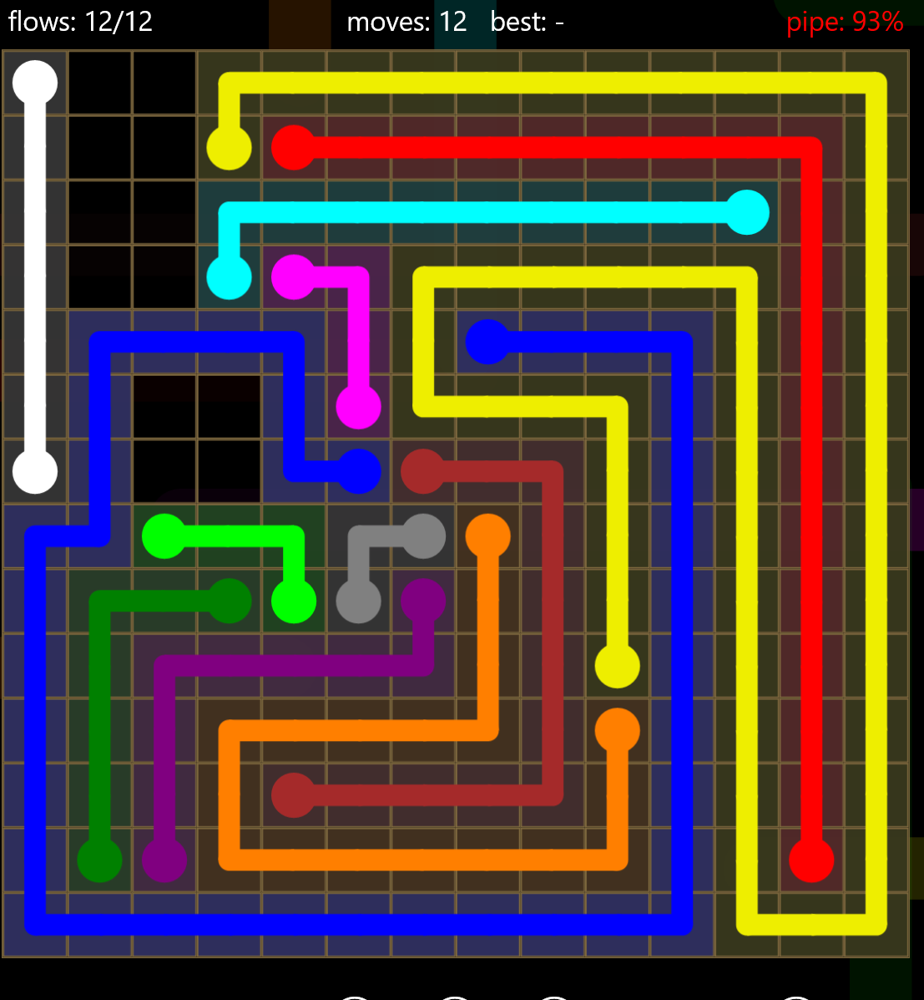

# Flowty

A solver for the classic **Flow Free** puzzle that combines computer vision and constraint solving. This project uses **OpenCV** to interpret puzzle images and a **SAT solver** to compute valid solutions.

## 🧩 What is Flow Free?

Flow Free is a logic puzzle played on a grid. The goal is to connect matching colors with continuous paths such that:

- Each pair of identical numbers is connected
- Paths do not cross or overlap
- Every cell in the grid is filled

## 🚀 Features
- 📷 **Image-based input**: Extract puzzles from images and live games
- 🧠 **SAT-based solving**: Converts puzzles into Boolean constraints and solves them efficiently with SAT
- ✅ **Valid solution generation**: Ensures all Flow Free rules are satisfied
- 🖥️ **Visualization support**: Draws the solution in game

## 🙏 Acknowledgements

- Inspired by the Flow puzzle concept
- Uses [xcap](https://github.com/nashaofu/xcap) to capture the screen
- Uses [OpenCV-rust](https://github.com/twistedfall/opencv-rust) for image processing, specifically the rust port,
- Uses [RustSat](https://github.com/chrjabs/rustsat) for SAT solving,
- Uses [Engio](https://github.com/enigo-rs/enigo) for mouse input
- Uses [Spin-Sleep](https://github.com/alexheretic/spin-sleep) for proper timing

As well as many other instrumental rust crates

And some additional links

- https://torvaney.github.io/projects/flow-solver.html
- https://mzucker.github.io/2016/08/28/flow-solver.html
- https://mzucker.github.io/2016/09/02/eating-sat-flavored-crow.html
- https://github.com/mzucker/flow_solver/blob/master/pyflowsolver.py
- https://arxiv.org/html/2505.15221v1#S3.T1
- https://github.com/leophagus/Flow-Free-Solver/tree/master
- https://www.youtube.com/watch?v=XU4Xk_zg9jI
- https://www.samueltgoldman.com/post/flow-solver/

## Grievances
I have been working on this project over the span of 6 months. 95% of the time I spent programming was on the image recognition. I wanted it to support every type of flow level imaginable, however, after 3 months of trying, I decided to take a break and instead learn about boolean satisfiability and how I can use it, as well as the screen capturing and input automation. All of that took me less than 24 hours (total time spent). Seeing this, I was certain that soon enough, I would finally perfect the image recognition. So I installed gimp, made some gimp plugins, used decision trees to try and find a connection, tried plotting to see if I could see a pattern, learned some color theory; But that moment never came. After another 3 months, I decided to forget about solving warps or under/overpasses or bridges, and just focus on the base game, flow free, and a continuation, flow shapes. Currently, It can solve non-uniform split boards with varying cell sizes, and chains, and walls. It can sometimes solve windmills. Flow makes the endpoints of lines dim sometimes which messes up the recognition. If you are interested in seeing the history of my image recognition algorithm, You can go to /dichromate/saves, /scripts, and /semilogs.md in the initial commit. I'm not sure I'll keep them. Also the dataset of 417 is not completely representative of the whole game. I noticed some kind of long bring structure by accident after I made the dataset.

## Interesting Note
I tested this on the flow free app for windows and my solver found a solution that didn't use every cell

Jumbo Pack 14x14 Level 26. However, on the mobile version, I haven't found anything like this so far. I believe the version on the microsoft store is outdated.

## Special Thanks
This project would absolutely not exist without a certain friend who I admire. If you see this, you know who you are 😉. Additonally, to my friends who doubted me, who'se laughing now >:D (I'm not 😭)

## 📄 License
This project is licensed under the MIT License.